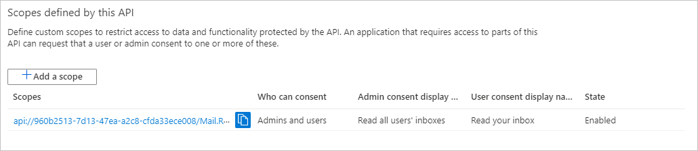
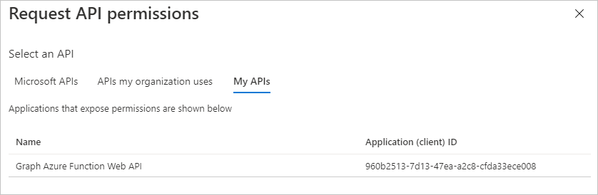

<!-- markdownlint-disable MD002 MD041 -->

Neste exercício, você criará três novos aplicativos do Azure AD usando o centro de administração do Azure Active Directory:

- Um registro de aplicativo para o aplicativo de página única para que ele possa entrar em usuários e obter tokens permitindo que o aplicativo chame a função do Azure.
- Um registro de aplicativo para a função do Azure que permite que ele use o [fluxo em nome de](https://docs.microsoft.com/azure/active-directory/develop/v2-oauth2-on-behalf-of-flow) para trocar o token enviado pelo Spa para um token que lhe permitirá chamar o Microsoft Graph.
- Um registro de aplicativo para o webhook de função do Azure que permite que ele use o [fluxo de credenciais do cliente](https://docs.microsoft.com/azure/active-directory/develop/v2-oauth2-client-creds-grant-flow) para chamar o Microsoft Graph sem um usuário.

> [!NOTE]
> Este exemplo requer três registros de aplicativo, pois está implementando o fluxo em nome de e o fluxo de credenciais do cliente. Se sua função do Azure usar apenas um desses fluxos, você só precisará criar os registros de aplicativo que correspondem a esse fluxo.

1. Abra um navegador e navegue até o [centro de administração do Azure Active Directory](https://aad.portal.azure.com) e faça logon usando um administrador da organização de locatários do Microsoft 365.

1. Selecione **Azure Active Directory** na navegação esquerda e selecione **Registros de aplicativos** em **Gerenciar**.

    

## Registrar um aplicativo para o aplicativo de página única

1. Selecione **Novo registro**. Na página **Registrar um aplicativo** , defina os valores da seguinte forma.

    - Defina **Nome** para `Graph Azure Function Test App`.
    - Defina os **tipos de conta com suporte** para **contas nesse diretório organizacional apenas**.
    - Em **URI de redirecionamento** , altere o menu suspenso para o **aplicativo de página única (Spa)** e defina o valor como `http://localhost:8080` .

    

1. Selecione **Registrar**. Na página do **aplicativo de teste de função do Azure Graph** , copie os valores da ID do **aplicativo (cliente)** e da ID do **diretório (locatário)** e salve-os, você precisará deles nas etapas posteriores.

    

## Registrar um aplicativo para a função do Azure

1. Retorne a **registros de aplicativos** e selecione **novo registro**. Na página **Registrar um aplicativo** , defina os valores da seguinte forma.

    - Defina **Nome** para `Graph Azure Function`.
    - Defina os **tipos de conta com suporte** para **contas nesse diretório organizacional apenas**.
    - Deixe **URI de redirecionamento** em branco.

1. Selecione **Registrar**. Na página de **função do Azure Graph** , copie o valor da **ID do aplicativo (cliente)** e salve-o, você precisará dele na próxima etapa.

1. Selecione **Certificados e segredos** sob **Gerenciar**. Selecione o botão **Novo segredo do cliente**. Insira um valor em **Descrição** e selecione uma das opções para **expirar** e selecione **Adicionar**.

    

1. Copie o valor secreto do cliente antes de sair desta página. Você precisará dele na próxima etapa.

    > [!IMPORTANT]
    > Este segredo do cliente nunca é mostrado novamente, portanto, copie-o agora.

    

1. Selecione **permissões de API** em **gerenciar**. Escolha **Adicionar uma permissão**.

1. Selecione **Microsoft Graph** e, em seguida, **permissões delegadas**. Adicione **mail. Read** e selecione **Add Permissions**.

    

1. Selecione **expor uma API** em **gerenciar** e, em seguida, escolha **Adicionar um escopo**.

1. Aceite o **URI da ID do aplicativo** padrão e escolha **salvar e continuar**.

1. Preencha o formulário **Adicionar um escopo** da seguinte maneira:

    - **Nome do escopo:** Mail. Read
    - **Quem pode consenter?:** Administradores e usuários
    - **Nome para exibição do consentimento do administrador:** Ler caixas de entrada de todos os usuários
    - **Descrição do consentimento do administrador:** Permite que o aplicativo Leia as caixas de entrada de todos os usuários
    - **Nome para exibição do consentimento do usuário:** Ler sua caixa de entrada
    - **Descrição do consentimento do usuário:** Permite que o aplicativo Leia sua caixa de entrada
    - **Estado:** Permiti

1. Selecione **Adicionar escopo**.

1. Copie o novo escopo, você precisará dele nas etapas posteriores.

    

1. Selecione **manifesto** em **gerenciar**.

1. Localize `knownClientApplications` no manifesto e substitua o valor atual `[]` por `[TEST_APP_ID]` , em que `TEST_APP_ID` é a ID do aplicativo do registro do aplicativo de **aplicativo de teste de função do Azure** . Selecione **Salvar**.

> [!NOTE]
> A adição da ID de aplicativo do aplicativo de teste à `knownClientApplications` propriedade no manifesto da função do Azure permite que o aplicativo de teste dispare um [fluxo de consentimento combinado](https://docs.microsoft.com/azure/active-directory/develop/v2-oauth2-on-behalf-of-flow#default-and-combined-consent). Isso é necessário para o fluxo em nome de para funcionar.

## Adicionar o escopo de função do Azure para testar o registro do aplicativo

1. Retorne ao registro de **aplicativo de teste de função do Azure Graph** e selecione **permissões de API** em **gerenciar**. Selecione **Adicionar uma permissão**.

1. Selecione **minhas APIs** e, em seguida, selecione **carregar mais**. Selecione a **função Graph do Azure**.

    

1. Selecione a permissão **mail. Read** e, em seguida, selecione **adicionar permissões**.

1. Nas **permissões configuradas** , remova a permissão **User. Read** no **Microsoft Graph** selecionando o **...** à direita da permissão e selecionando **remover permissão**. Selecione **Sim, remover** para confirmar.

    

## Registrar um aplicativo para o webhook de função do Azure

1. Retorne a **registros de aplicativos** e selecione **novo registro**. Na página **Registrar um aplicativo** , defina os valores da seguinte forma.

    - Defina **Nome** para `Graph Azure Function Webhook`.
    - Defina os **tipos de conta com suporte** para **contas nesse diretório organizacional apenas**.
    - Deixe **URI de redirecionamento** em branco.

1. Selecione **Registrar**. Na página **webhook da função de gráfico do Azure** , copie o valor da **ID do aplicativo (cliente)** e salve-o, você precisará dele na próxima etapa.

1. Selecione **Certificados e segredos** sob **Gerenciar**. Selecione o botão **Novo segredo do cliente**. Insira um valor em **Descrição** e selecione uma das opções para **expirar** e selecione **Adicionar**.

1. Copie o valor secreto do cliente antes de sair desta página. Você precisará dele na próxima etapa.

1. Selecione **permissões de API** em **gerenciar**. Escolha **Adicionar uma permissão**.

1. Selecione **Microsoft Graph** e, em seguida, **permissões de aplicativo**. Adicione **User. Read. All** e **mail. Read** e, em seguida, selecione **adicionar permissões**.

1. Nas **permissões configuradas** , remova a permissão **usuário delegado. Read** no **Microsoft Graph** selecionando o **...** à direita da permissão e selecionando **remover permissão**. Selecione **Sim, remover** para confirmar.

1. Selecione o botão **conceder permissão de administrador para...** e, em seguida, selecione **Sim** para conceder consentimento de administrador para as permissões de aplicativo configuradas. A coluna **status** na tabela de **permissões configurada** é alterada para **concedido para..**..

    
