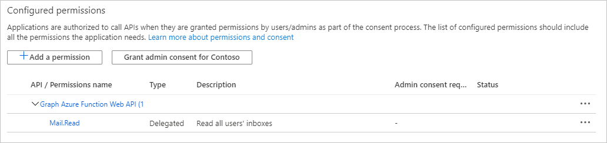

<!-- markdownlint-disable MD002 MD041 -->

Neste exercício, você criará três novos aplicativos do Azure AD usando o centro de administração do Azure Active Directory:In this exercise you will create three new Azure AD applications using the Azure Active Directory admin center:

- Um registro de aplicativo para o aplicativo de página única para que ele possa entrar em usuários e obter tokens permitindo que o aplicativo chame a função do Azure.An app registration for the single-page application so that it can sign in users and get tokens allowing the application to call the Azure Function.
- Um registro de aplicativo para a função do Azure que permite que ele use o [fluxo em nome de](https://docs.microsoft.com/azure/active-directory/develop/v2-oauth2-on-behalf-of-flow) para trocar o token enviado pelo Spa para um token que lhe permitirá chamar o Microsoft Graph.An app registration for the Azure Function that allows it to use the [on-behalf-of flow](https://docs.microsoft.com/azure/active-directory/develop/v2-oauth2-on-behalf-of-flow) to exchange the token sent by the SPA for a token that will allow it to call Microsoft Graph.
- Um registro de aplicativo para o webhook de função do Azure que permite que ele use o [fluxo de credenciais do cliente](https://docs.microsoft.com/azure/active-directory/develop/v2-oauth2-client-creds-grant-flow) para chamar o Microsoft Graph sem um usuário.An app registration for the Azure Function webhook that allows it to use the [client credential flow](https://docs.microsoft.com/azure/active-directory/develop/v2-oauth2-client-creds-grant-flow) to call Microsoft Graph without a user.

> [!NOTE]
> Este exemplo requer três registros de aplicativo, pois está implementando o fluxo em nome de e o fluxo de credenciais do cliente.This example requires three app registrations because it is implementing both the on-behalf-of flow and the client credential flow. Se sua função do Azure usar apenas um desses fluxos, você só precisará criar os registros de aplicativo que correspondem a esse fluxo.If your Azure Function only uses one of these flows, you would only need to create the app registrations that correspond to that flow.

1. Abra um navegador e navegue até o [centro de administração do Azure Active Directory](https://aad.portal.azure.com) e faça logon usando um administrador da organização de locatários do Microsoft 365.Open a browser and navigate to the [Azure Active Directory admin center](https://aad.portal.azure.com) and login using an Microsoft 365 tenant organization admin.

1. Selecione **Azure Active Directory** na navegação esquerda e selecione **Registros de aplicativos** em **Gerenciar**.Select **Azure Active Directory** in the left-hand navigation, then select **App registrations** under **Manage**.

    

## Registrar um aplicativo para o aplicativo de página únicaRegister an app for the single-page application

1. Selecione **Novo registro**.Select **New registration**. Na página **Registrar um aplicativo** , defina os valores da seguinte forma.On the **Register an application** page, set the values as follows.

    - Defina **Nome** para `Graph Azure Function Test App`.Set **Name** to `Graph Azure Function Test App`.
    - Defina os **tipos de conta com suporte** para **contas nesse diretório organizacional apenas**.Set **Supported account types** to **Accounts in this organizational directory only**.
    - Em **URI de redirecionamento** , altere o menu suspenso para o **aplicativo de página única (Spa)** e defina o valor como `http://localhost:8080` .Under **Redirect URI** , change the dropdown to **Single-page application (SPA)** and set the value to `http://localhost:8080`.

    

1. Selecione **Registrar**.Select **Register**. Na página do **aplicativo de teste de função do Azure Graph** , copie os valores da ID do **aplicativo (cliente)** e da ID do **diretório (locatário)** e salve-os, você precisará deles nas etapas posteriores.On the **Graph Azure Function Test App** page, copy the values of the **Application (client) ID** and **Directory (tenant) ID** and save them, you will need them in the later steps.

    

## Registrar um aplicativo para a função do AzureRegister an app for the Azure Function

1. Retorne a **registros de aplicativos** e selecione **novo registro**.Return to **App Registrations** , and select **New registration**. Na página **Registrar um aplicativo** , defina os valores da seguinte forma.On the **Register an application** page, set the values as follows.

    - Defina **Nome** para `Graph Azure Function`.Set **Name** to `Graph Azure Function`.
    - Defina os **tipos de conta com suporte** para **contas nesse diretório organizacional apenas**.Set **Supported account types** to **Accounts in this organizational directory only**.
    - Deixe **URI de redirecionamento** em branco.Leave **Redirect URI** blank.

1. Selecione **Registrar**.Select **Register**. Na página de **função do Azure Graph** , copie o valor da **ID do aplicativo (cliente)** e salve-o, você precisará dele na próxima etapa.On the **Graph Azure Function** page, copy the value of the **Application (client) ID** and save it, you will need it in the next step.

1. Selecione **Certificados e segredos** sob **Gerenciar**.Select **Certificates & secrets** under **Manage**. Selecione o botão **Novo segredo do cliente**.Select the **New client secret** button. Insira um valor em **Descrição** e selecione uma das opções para **expirar** e selecione **Adicionar**.Enter a value in **Description** and select one of the options for **Expires** and select **Add**.

    

1. Copie o valor secreto do cliente antes de sair desta página.Copy the client secret value before you leave this page. Você precisará dele na próxima etapa.You will need it in the next step.

    > [!IMPORTANT]
    > Este segredo do cliente nunca é mostrado novamente, portanto, copie-o agora.This client secret is never shown again, so make sure you copy it now.

    

1. Selecione **permissões de API** em **gerenciar**.Select **API Permissions** under **Manage**. Escolha **Adicionar uma permissão**.Choose **Add a permission**.

1. Selecione **Microsoft Graph** e, em seguida, **permissões delegadas**.Select **Microsoft Graph** , then **Delegated Permissions**. Adicione **mail. Read** e selecione **Add Permissions**.Add **Mail.Read** and select **Add permissions**.

    

1. Selecione **expor uma API** em **gerenciar** e, em seguida, escolha **Adicionar um escopo**.Select **Expose an API** under **Manage** , then choose **Add a scope**.

1. Aceite o **URI da ID do aplicativo** padrão e escolha **salvar e continuar**.Accept the default **Application ID URI** and choose **Save and continue**.

1. Preencha o formulário **Adicionar um escopo** da seguinte maneira:Fill in the **Add a scope** form as follows:

    - **Nome do escopo:** Mail. Read**Scope name:** Mail.Read
    - **Quem pode consenter?:** Administradores e usuários**Who can consent?:** Admins and users
    - **Nome para exibição do consentimento do administrador:** Ler caixas de entrada de todos os usuários**Admin consent display name:** Read all users' inboxes
    - **Descrição do consentimento do administrador:** Permite que o aplicativo Leia as caixas de entrada de todos os usuários**Admin consent description:** Allows the app to read all users' inboxes
    - **Nome para exibição do consentimento do usuário:** Ler sua caixa de entrada**User consent display name:** Read your inbox
    - **Descrição do consentimento do usuário:** Permite que o aplicativo Leia sua caixa de entrada**User consent description:** Allows the app to read your inbox
    - **Estado:** Permiti**State:** Enabled

1. Selecione **Adicionar escopo**.Select **Add scope**.

1. Copie o novo escopo, você precisará dele nas etapas posteriores.Copy the new scope, you'll need it in later steps.

    

1. Selecione **manifesto** em **gerenciar**.Select **Manifest** under **Manage**.

1. Localize `knownClientApplications` no manifesto e substitua o valor atual `[]` por `[TEST_APP_ID]` , em que `TEST_APP_ID` é a ID do aplicativo do registro do aplicativo de **aplicativo de teste de função do Azure** .Locate `knownClientApplications` in the manifest, and replace it's current value of `[]` with `[TEST_APP_ID]`, where `TEST_APP_ID` is the application ID of the **Graph Azure Function Test App** app registration. Selecione **Salvar**.Select **Save**.

> [!NOTE]
> A adição da ID de aplicativo do aplicativo de teste à `knownClientApplications` propriedade no manifesto da função do Azure permite que o aplicativo de teste dispare um [fluxo de consentimento combinado](https://docs.microsoft.com/azure/active-directory/develop/v2-oauth2-on-behalf-of-flow#default-and-combined-consent).Adding the test application's app ID to the `knownClientApplications` property in the Azure Function's manifest allows the test application to trigger a [combined consent flow](https://docs.microsoft.com/azure/active-directory/develop/v2-oauth2-on-behalf-of-flow#default-and-combined-consent). Isso é necessário para o fluxo em nome de para funcionar.This is necessary for the on-behalf-of flow to work.

## Adicionar o escopo de função do Azure para testar o registro do aplicativoAdd Azure Function scope to test application registration

1. Retorne ao registro de **aplicativo de teste de função do Azure Graph** e selecione **permissões de API** em **gerenciar**.Return to the **Graph Azure Function Test App** registration, and select **API Permissions** under **Manage**. Selecione **Adicionar uma permissão**.Select **Add a permission**.

1. Selecione **minhas APIs** e, em seguida, selecione **carregar mais**.Select **My APIs** , then select **Load more**. Selecione a **função Graph do Azure**.Select **Graph Azure Function**.

    

1. Selecione a permissão **mail. Read** e, em seguida, selecione **adicionar permissões**.Select the **Mail.Read** permission, then select **Add permissions**.

1. Nas **permissões configuradas** , remova a permissão **User. Read** no **Microsoft Graph** selecionando o **...** à direita da permissão e selecionando **remover permissão**.In the **Configured permissions** , remove the **User.Read** permission under **Microsoft Graph** by selecting the **...** to the right of the permission and selecting **Remove permission**. Selecione **Sim, remover** para confirmar.Select **Yes, remove** to confirm.

    

## Registrar um aplicativo para o webhook de função do AzureRegister an app for the Azure Function webhook

1. Retorne a **registros de aplicativos** e selecione **novo registro**.Return to **App Registrations** , and select **New registration**. Na página **Registrar um aplicativo** , defina os valores da seguinte forma.On the **Register an application** page, set the values as follows.

    - Defina **Nome** para `Graph Azure Function Webhook`.Set **Name** to `Graph Azure Function Webhook`.
    - Defina os **tipos de conta com suporte** para **contas nesse diretório organizacional apenas**.Set **Supported account types** to **Accounts in this organizational directory only**.
    - Deixe **URI de redirecionamento** em branco.Leave **Redirect URI** blank.

1. Selecione **Registrar**.Select **Register**. Na página **webhook da função de gráfico do Azure** , copie o valor da **ID do aplicativo (cliente)** e salve-o, você precisará dele na próxima etapa.On the **Graph Azure Function webhook** page, copy the value of the **Application (client) ID** and save it, you will need it in the next step.

1. Selecione **Certificados e segredos** sob **Gerenciar**.Select **Certificates & secrets** under **Manage**. Selecione o botão **Novo segredo do cliente**.Select the **New client secret** button. Insira um valor em **Descrição** e selecione uma das opções para **expirar** e selecione **Adicionar**.Enter a value in **Description** and select one of the options for **Expires** and select **Add**.

1. Copie o valor secreto do cliente antes de sair desta página.Copy the client secret value before you leave this page. Você precisará dele na próxima etapa.You will need it in the next step.

1. Selecione **permissões de API** em **gerenciar**.Select **API Permissions** under **Manage**. Escolha **Adicionar uma permissão**.Choose **Add a permission**.

1. Selecione **Microsoft Graph** e, em seguida, **permissões de aplicativo**.Select **Microsoft Graph** , then **Application Permissions**. Adicione **User. Read. All** e **mail. Read** e, em seguida, selecione **adicionar permissões**.Add **User.Read.All** and **Mail.Read** , then select **Add permissions**.

1. Nas **permissões configuradas** , remova a permissão **usuário delegado. Read** no **Microsoft Graph** selecionando o **...** à direita da permissão e selecionando **remover permissão**.In the **Configured permissions** , remove the delegated **User.Read** permission under **Microsoft Graph** by selecting the **...** to the right of the permission and selecting **Remove permission**. Selecione **Sim, remover** para confirmar.Select **Yes, remove** to confirm.

1. Selecione o botão **conceder permissão de administrador para...** e, em seguida, selecione **Sim** para conceder consentimento de administrador para as permissões de aplicativo configuradas.Select the **Grant admin consent for...** button, then select **Yes** to grant admin consent for the configured application permissions. A coluna **status** na tabela de **permissões configurada** é alterada para **concedido para..**..The **Status** column in the **Configured permissions** table changes to **Granted for ...**.

    
